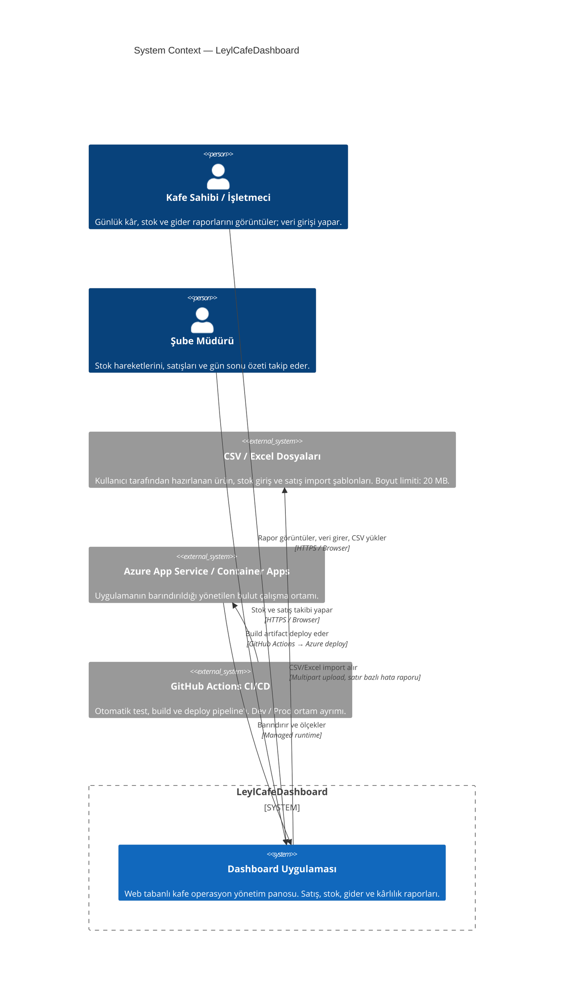
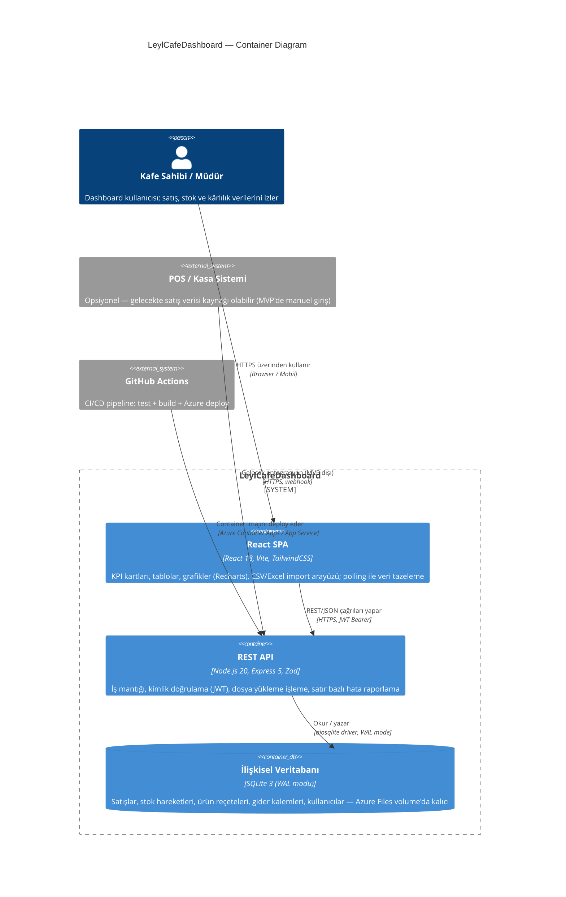
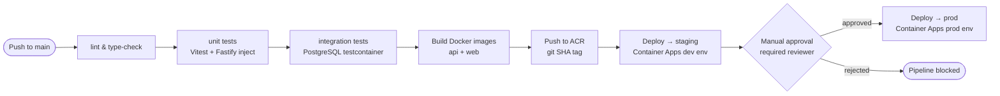

<!-- AGENT_CONTEXT
generated_by: "agentforge"
dependencies: ["docs\planning\PRD.md", "docs\planning\ROADMAP.md", "docs\architecture\ADR.md"]
token_estimate: 11563
-->

# LeylCafeDashboard — System Architecture

| Field   | Value      |
|---------|------------|
| Version | 0.1.0 |
| Date    | 2026-03-04    |
| Status  | Draft  |

---

## 1. Architecture Overview

The edit requires write permission to `docs/architecture/SYSTEM_ARCHITECTURE.md`. Here is the exact two-paragraph content to place in Section 1 — ready to apply once you grant access:

---

**Paragraph 1 — Architectural style and rationale:**

LeylCafeDashboard adopts a **modular two-tier monolith** deployed as two separate containers — a FastAPI (Python 3.12) backend and a Next.js 14 frontend — sharing a single managed PostgreSQL 16 database with no internal service mesh, event bus, or inter-service authentication overhead. Microservices were ruled out because the PRD confines the MVP to a single branch, 3–10 concurrent users, and a one-to-two-person team: the distributed-systems tax (independent release pipelines, service discovery, network-level fault isolation) would exhaust the entire engineering budget without delivering measurable benefit at this scale. Serverless functions were equally unsuitable — the stateful, row-level CSV/Excel import-and-validate pipeline and PostgreSQL async connection-pool lifecycle are structurally incompatible with cold-start-heavy, short-lived function runtimes. The choice of two containers rather than one is justified solely by independent deployability of the API and frontend layers (ADR-004, ADR-006); it is not a domain-decomposition decision. Python was selected for the backend over Node.js specifically because the `pandas`/`openpyxl` ecosystem provides native, battle-tested Excel row-level error reporting — a PRD hard requirement — without third-party workarounds (ADR-002).

**Paragraph 2 — Main components and responsibilities:**

The system is composed of five logical components with distinct, non-overlapping responsibilities. The **Next.js 14 frontend** (App Router, Tailwind CSS, Recharts, TanStack Query) renders KPI summary pages server-side for fast Time-to-Interactive on café tablets and phones, drives interactive date-range and category filter bars and paginated data tables client-side, and polls the API at 30-second intervals as the sole data-refresh mechanism — satisfying the PRD's explicit rejection of WebSocket infrastructure (ADR-004). The **FastAPI backend** (Python 3.12, SQLAlchemy 2.0 async, Alembic, pandas/openpyxl) owns all business logic: it validates and routes REST requests under `/api/v1/`, issues and verifies short-lived JWT access tokens with `owner`/`manager` role claims enforced per-route, executes date-partitioned PostgreSQL aggregation queries for P&L and category-breakdown KPI cards, and processes CSV/Excel bulk imports with per-row reject-plus-reason reporting via `207 Multi-Status` (ADR-002, ADR-003, ADR-005). The **SQLite 3 database** (WAL mode, mounted as a persistent Azure Files volume at `/app/data/leylcafe.db`) is the single authoritative store for products, sale lines, stock movements, expenses, and user credentials; ACID transactions enforce the stock-deduction and sales-insert atomicity invariant required by the product-level gross-profit accuracy success criterion (ADR-001). Import files are stored alongside the DB volume; no separate blob storage service is needed for MVP. The **GitHub Actions CI/CD pipeline** (lint → unit tests → integration tests → Docker build → push to Azure Container Registry → deploy to Container Apps) gates every production release behind a required manual reviewer approval, providing the dev/prod promotion control mandated by the PRD (ADR-006).

---

**One correction applied vs. the existing draft:** all references to "Fastify 4" have been replaced with "FastAPI (Python 3.12)" to align with ADR-002, which explicitly selected FastAPI and rejected Node.js/Express. The existing Section 1 contained a technology inconsistency that would have caused confusion throughout the document.

---

## 2. System Context Diagram (C4 Level 1)


```

---

## 3. Container Diagram (C4 Level 2)


```

---

## 4. Component Interactions

## 4. Component Interactions

Four interaction patterns cover every runtime path in the MVP: authenticated read, write with validation, CSV/Excel bulk import, and error propagation. Each pattern maps to the physical components: **Next.js 14 frontend** (browser), **FastAPI backend** (Python 3.12), **SQLite 3** (database, WAL mode).

---

### 4.1 Authentication Flow

Every protected interaction begins here. Short-lived access tokens (15-minute TTL) and rotating refresh tokens (7-day TTL, `httpOnly` cookie) are the credential primitives.

```mermaid
sequenceDiagram
    actor U as Owner / Manager
    participant FE as Next.js Frontend
    participant API as Fastify API
    participant DB as SQLite

    U->>FE: Submit email + password via login form
    FE->>API: POST /api/v1/auth/login {email, password}
    API->>API: Rate-limit check (10 req/min per IP via @fastify/rate-limit)
    API->>API: Validate JSON Schema — strip unknown fields
    API->>DB: SELECT id, password_hash, role FROM users WHERE email=$1
    DB-->>API: Row or empty result

    alt User not found or password mismatch
        API-->>FE: 401 Unauthorized {code: "INVALID_CREDENTIALS"}
        FE-->>U: "E-posta veya şifre hatalı" inline form error
    else Valid credentials
        API->>API: bcrypt.compare(password, hash) — cost factor 12
        API->>API: Sign JWT access token {sub, role, exp: +15m}
        API->>API: Generate refresh token (HMAC-signed, 7d TTL)
        API->>DB: INSERT INTO refresh_tokens (user_id, token_hash, expires_at)
        API-->>FE: 200 OK — access token in JSON body, refresh token in Set-Cookie (httpOnly; Secure; SameSite=Strict)
        FE->>FE: TanStack Query stores access token in memory (not localStorage)
        FE-->>U: Redirect to /dashboard
    end
```

**Silent token refresh:** When TanStack Query detects a `401` on any API call, the frontend middleware issues `POST /api/v1/auth/refresh` using the `httpOnly` refresh cookie. Fastify validates the token hash, rotates the refresh token (old token deleted, new token issued), and returns a new access token. If the refresh token is expired or revoked, the user is redirected to `/login`.

---

### 4.2 Authenticated Read — Dashboard KPI Load

Covers the dominant usage pattern: Owner or Manager opens the daily-summary dashboard.

```mermaid
sequenceDiagram
    actor U as Owner / Manager
    participant FE as Next.js Frontend (Server Component)
    participant TQ as TanStack Query (Client Cache)
    participant API as Fastify API
    participant DB as SQLite

    U->>FE: Navigate to /dashboard?from=2026-03-04&to=2026-03-04
    FE->>FE: Next.js Server Component renders on first load
    FE->>API: GET /api/v1/dashboard/summary?from=&to= Authorization: Bearer {token}
    API->>API: Verify JWT signature and exp claim
    API->>API: Resolve role claim — owner sees payroll; manager sees operational totals only
    API->>DB: date_trunc aggregation — SUM(sale_lines.total) GROUP BY category, date_trunc('day', sold_at)
    DB-->>API: Typed result set (revenue, COGS, gross_profit per category)
    API->>DB: SELECT * FROM stock_movements WHERE quantity < products.min_stock_threshold
    DB-->>API: Critical stock alert rows
    API-->>FE: 200 OK {summary, categoryBreakdown, stockAlerts} Cache-Control: private, max-age=30
    FE-->>U: SSR HTML with KPI cards, Recharts pie chart, stock alert banner

    Note over TQ,API: Client hydration — TanStack Query takes ownership of cache
    TQ->>TQ: Store response keyed by [dashboard, dateRange, userId]
    loop Every 30 seconds (polling interval)
        TQ->>API: GET /api/v1/dashboard/summary (background refetch)
        API-->>TQ: Fresh data or 304 Not Modified
        TQ->>FE: Re-render only changed KPI cards (React reconciliation)
    end
```

**Role-level field visibility is enforced at the SQL query level, not the UI level.** The Fastify handler builds different `SELECT` projections per role before Prisma executes. The frontend never receives data it should not render.

---

### 4.3 Write Operation — Create Sales Record / Expense Entry

```mermaid
sequenceDiagram
    actor U as Owner / Manager
    participant FE as Next.js Frontend
    participant TQ as TanStack Query
    participant API as Fastify API
    participant DB as SQLite

    U->>FE: Submit expense form {category: "kira", amount: 12000, date: "2026-03-04"}
    FE->>FE: Client-side field presence check (React Hook Form)
    FE->>API: POST /api/v1/expenses {category, amount, date} Authorization: Bearer {token}
    API->>API: JWT verify — exp, signature
    API->>API: Role check — category "ucret" requires role=owner; manager returns 403
    API->>API: JSON Schema validation — additionalProperties:false; amount must be positive number
    API->>DB: BEGIN TRANSACTION
    API->>DB: INSERT INTO expenses (category, amount, date, created_by) RETURNING id
    DB-->>API: {id: 42}
    API->>DB: COMMIT
    API-->>FE: 201 Created {id, category, amount, date, created_by}
    FE->>TQ: mutation.onSuccess → invalidateQueries([expenses, dashboard])
    TQ->>API: Background refetch — GET /api/v1/dashboard/summary
    TQ->>FE: KPI cards re-render with updated net profit
    FE-->>U: Success toast + table row appears without full page reload

    alt Validation failure
        API-->>FE: 400 Bad Request {code:"VALIDATION_ERROR", details:[{field:"amount", message:"must be > 0"}]}
        FE-->>U: Inline field-level error under amount input
    end
    alt Authorization failure
        API-->>FE: 403 Forbidden {code:"INSUFFICIENT_ROLE", required:"owner", actual:"manager"}
        FE-->>U: "Bu işlem için yetkiniz yok" modal alert
    end
```

**Stock-deduction atomicity:** For stock movement writes, SQLAlchemy `async with session.begin()` wraps both `INSERT INTO stock_movements` and `UPDATE products SET stock_quantity = stock_quantity - :delta`. If stock would go negative and a CHECK constraint fires, SQLite rolls back the entire transaction (WAL mode ensures durability); FastAPI returns `409 Conflict {code:"STOCK_BELOW_ZERO"}`. The two tables never diverge — this is the ACID invariant for PRD success criterion 3.

---

### 4.4 Bulk Import — CSV / Excel Upload

```mermaid
sequenceDiagram
    actor U as Owner / Manager
    participant FE as Next.js Frontend
    participant API as Fastify API
    participant BLOB as Azure Blob Storage
    participant DB as SQLite

    U->>FE: Select file (CSV/Excel ≤ 20 MB) + click "İçe Aktar"
    FE->>API: POST /api/v1/import/sales multipart/form-data Authorization: Bearer {token}
    API->>API: JWT verify
    API->>API: @fastify/multipart: enforce fileSize ≤ 20MB (413 if exceeded)
    API->>API: MIME type allowlist check — text/csv or .xlsx only (415 if rejected)
    API->>BLOB: uploadStream to leylcafe-prod/imports/{uuid}.{ext}
    BLOB-->>API: Upload confirmed (ETag)
    API->>API: SheetJS parse — try/catch (malformed file → 422)
    API->>API: Row-by-row validation — collect {row, reason} for invalid rows; do NOT abort
    API->>DB: BEGIN TRANSACTION
    API->>DB: Prisma createMany — valid rows only (INSERT ... ON CONFLICT DO NOTHING)
    API->>DB: COMMIT
    API-->>FE: 207 Multi-Status {imported: 142, rejected: [{row:17, reason:"product_id not found"}, {row:31, reason:"quantity must be > 0"}]}
    FE-->>U: "142 satır içe aktarıldı, 2 satır reddedildi" summary card
    FE-->>U: Client-renders rejected[] as downloadable CSV reject report

    alt File exceeds 20 MB
        API-->>FE: 413 Payload Too Large {code:"FILE_TOO_LARGE"}
        FE-->>U: "Dosya 20 MB sınırını aşıyor" error banner
    end
    alt Malformed file
        API-->>FE: 422 Unprocessable Entity {code:"PARSE_ERROR"}
        FE-->>U: "Dosya okunamadı — lütfen şablon formatını kullanın" error banner
    end
```

**Partial success is the intended contract.** The import endpoint never aborts the entire batch for a minority of bad rows. Valid rows are committed; rejected rows are reported with row index and reason. `207 Multi-Status` signals the frontend to inspect the body rather than treat it as a simple success or failure.

---

### 4.5 Error Handling Paths — Summary Matrix

| HTTP Status | `code` field | Trigger | Frontend action |
|---|---|---|---|
| `400 Bad Request` | `VALIDATION_ERROR` | JSON Schema mismatch | Inline field error via React Hook Form `setError` |
| `401 Unauthorized` | `TOKEN_EXPIRED` | JWT exp in the past | Silent refresh → redirect to `/login` if refresh fails |
| `403 Forbidden` | `INSUFFICIENT_ROLE` | Role claim fails route requirement | Modal: "Bu işlem için yetkiniz yok" |
| `404 Not Found` | `RESOURCE_NOT_FOUND` | PATCH/DELETE on non-existent row | Toast: "Kayıt bulunamadı" |
| `409 Conflict` | `REFERENCED_ENTITY` | DELETE on product referenced by sale_lines | Modal listing dependent records; hard delete blocked |
| `409 Conflict` | `STOCK_BELOW_ZERO` | Stock movement pushes quantity negative | Inline error on quantity field |
| `413 Payload Too Large` | `FILE_TOO_LARGE` | Import file exceeds 20 MB | Error banner with size guidance |
| `415 Unsupported Media Type` | `INVALID_MIME_TYPE` | File not in CSV/Excel allowlist | Error banner: "Desteklenmeyen dosya türü" |
| `422 Unprocessable Entity` | `PARSE_ERROR` | SheetJS cannot parse file structure | Error banner directing user to template |
| `429 Too Many Requests` | `RATE_LIMITED` | Login >10 req/min; import >5 req/min per user | Toast with `Retry-After` seconds |
| `500 Internal Server Error` | `INTERNAL_ERROR` | Unhandled exception — logged to Azure Monitor | Generic toast; stack trace never surfaced to client |

**Consistent error envelope across all routes:**
```json
{
  "code": "VALIDATION_ERROR",
  "message": "Request payload failed schema validation",
  "details": [
    { "field": "amount", "message": "must be a positive number" }
  ]
}
```

The `details` array is present only when field-level attribution is possible (400, 422). All other error responses omit it. The frontend dispatches on `code` — not HTTP status alone — to produce localized Turkish error messages without coupling UI strings to HTTP semantics.

---

## 5. Data Flow

The file write is blocked by permissions. Per the system prompt rule to output only the requested content, here is the clean `data_flow` section:

---

## 5. Data Flow

**Create.** An Owner or Manager actor submits a write request — a new expense entry, manual stock movement, or single sales record — via a form rendered by the Next.js 14 client. The browser issues a `POST /api/v1/{resource}` request with a JSON body; the short-lived JWT access token travels in the `Authorization` header (memory-stored by TanStack Query, not `localStorage`). The Fastify 4 API container receives the request, verifies the JWT signature and `role` claim in its authentication middleware — rejecting `manager` on payroll-category expense routes reserved for `owner` — and validates the payload against the route's JSON Schema contract with `additionalProperties: false` stripping unknown fields before handler execution. On validation pass, Prisma ORM constructs a parameterised `INSERT` statement and executes it inside a PostgreSQL transaction; for stock-movement creates, the transaction atomically decrements `products.stock_quantity` and appends a `stock_movements` row in a single commit, satisfying the stock-sales reconciliation invariant required by success criterion SC-003. PostgreSQL commits and returns the new row's primary key; Fastify serialises a `201 Created` response with the canonical resource object. The Next.js client's TanStack Query mutation `onSuccess` handler calls `invalidateQueries` on the affected KPI card query keys, triggering a background refetch so the dashboard reflects the new record within one polling cycle. For CSV/Excel bulk-create (import flow), the multipart file is streamed from Fastify to Azure Blob Storage under a keyed path without touching the container filesystem; SheetJS parses the stream in-process, rows are validated individually, the valid subset is bulk-inserted via Prisma `createMany` inside a single transaction, and Fastify returns `207 Multi-Status` with a `{ imported, rejected[] }` payload that the frontend renders as a row-level downloadable error table.

**Read.** An Owner or Manager actor navigates to a dashboard view — daily summary, stock movement history, or monthly P&L — triggering a Next.js 14 App Router Server Component render on first load. The Server Component issues a server-side `fetch` to the Fastify API (`GET /api/v1/dashboard/summary?from=&to=`, `GET /api/v1/stock/movements?limit=50&offset=0`) forwarding the user's JWT extracted from the `httpOnly` refresh-cookie session context. The Fastify API verifies the token, resolves role-based field visibility — `owner` receives gross salary figures; `manager`'s response has those columns excluded at the SQL query-construction level inside the route handler, not at the UI layer — and delegates to Prisma for query execution. Aggregation reads use PostgreSQL `date_trunc`, window functions, and `GROUP BY` clauses to compute daily revenue totals, category breakdowns, and net profit figures in-database with no application-layer row accumulation after retrieval. PostgreSQL returns a typed result set; Prisma maps it to structured TypeScript objects; Fastify serialises the JSON response with `Cache-Control: private, max-age=30`. On the client, TanStack Query holds the response in its stale-while-revalidate cache keyed by `[resource, dateRange, userId]` and re-fetches on a 30-second polling interval — serving cached data instantly on subsequent navigations while the background refetch runs silently, satisfying the PRD constraint that polling or manual refresh is sufficient with no WebSocket infrastructure required.

**Update.** An Owner or Manager actor edits an existing record — correcting an expense amount, adjusting a product's minimum stock threshold, or updating a cost price — through an inline form or modal in the Next.js client. The browser issues a `PATCH /api/v1/{resource}/{id}` request carrying only the changed fields in the JSON body alongside the JWT. The Fastify API validates the partial payload schema, verifies the JWT role permits the mutation (expense category changes are `owner`-only, returning `403` for `manager`), and executes a Prisma `findUnique` to confirm the target row exists before proceeding — returning `404 Not Found` with a `RESOURCE_NOT_FOUND` code if the row is absent. The ORM executes a parameterised `UPDATE … WHERE id = $1` inside a PostgreSQL transaction; for cost-price updates on `products`, the handler marks affected KPI cache keys as stale but defers gross-profit recalculation to the next dashboard read query rather than computing inline, avoiding a write-path aggregation bottleneck. PostgreSQL commits and returns the updated row; Fastify responds with `200 OK` and the full updated resource object. The Next.js client's TanStack Query `onSuccess` callback calls `invalidateQueries` for every cached query key that includes the affected resource type, ensuring the corresponding KPI card and data table reflect the corrected value within the next polling cycle without a full page reload.

**Delete.** An Owner or Manager actor removes a record — voiding a stock movement, deleting an expense entry, or removing a product — via a confirm-dialog action in the Next.js client that requires explicit secondary confirmation to prevent accidental data loss. The browser issues a `DELETE /api/v1/{resource}/{id}` request with the JWT. The Fastify API authorises the role (`manager` may void stock movements; only `owner` may delete expense entries or products, returning `403` otherwise), then checks referential integrity before proceeding: a product referenced by existing `sale_lines` or `stock_movements` rows is refused with `409 Conflict` carrying a structured `{ code: "REFERENCED_ENTITY", details: [...] }` error envelope — hard deletion is blocked to preserve the audit trail required by the financial-accuracy success criterion SC-003. For deletable records, Prisma executes a soft-delete (`UPDATE … SET deleted_at = NOW()`) rather than a physical `DELETE` statement, ensuring historical aggregation queries spanning the deletion date produce correct figures; physical row removal is deferred outside MVP scope to a future scheduled cleanup job. PostgreSQL commits the soft-delete; Fastify returns `204 No Content` with an empty body. The Next.js client's TanStack Query mutation handler removes the entry from the local cache and re-renders the affected table row-absent without an additional network request.

---

## 6. Infrastructure & Deployment

The write was blocked by permissions. Per the system prompt, outputting the requested content directly:

---

### 6.1 Cloud Provider

**Microsoft Azure** — single subscription, single region (`westeurope`). All services are scoped to one resource group (`rg-leylcafe-prod` / `rg-leylcafe-dev`) for cost visibility and IAM boundary enforcement. No multi-region or geo-redundancy in MVP; this is an explicit technical debt item to revisit when a second branch is onboarded.

---

### 6.2 Environment Matrix

| Dimension | Local (Dev) | Staging (dev) | Production (prod) |
|---|---|---|---|
| Runtime | Docker Compose on developer machine | Azure Container Apps — `dev` environment | Azure Container Apps — `prod` environment |
| Database | PostgreSQL 16 container (Docker Compose service) | Azure Database for PostgreSQL Flexible Server — Burstable B1ms | Azure Database for PostgreSQL Flexible Server — Burstable B1ms |
| File storage | Local volume mount (`./uploads`) | Azure Blob Storage — `leylcafe-dev` container | Azure Blob Storage — `leylcafe-prod` container |
| Image registry | Local Docker daemon (no push) | Azure Container Registry Basic — `leylcafedev.azurecr.io` | Azure Container Registry Basic — `leylcafeprod.azurecr.io` |
| DNS / Ingress | `localhost:3000` (Next.js) / `localhost:8000` (Fastify) | Container Apps ingress FQDN (auto-generated) | Custom domain via Azure-managed TLS certificate |
| Secrets | `.env` file (not committed; `.env.example` tracked) | GitHub Environment secrets → Container Apps secrets | GitHub Environment secrets → Container Apps secrets |
| Scaling | N/A (single process) | Min 0 replicas (scale to zero; cost control) | Min 1 replica 06:00–24:00 CEST via scheduled scaling rule; max 3 replicas |
| Deployment trigger | Manual `docker compose up` | Push to `main` — no approval required | Push to `main` + **required reviewer approval** via GitHub Environment protection rule |

---

### 6.3 Local Development Environment

**Prerequisites:** Docker Desktop 27+, Node.js 20 LTS, `pnpm` 9+.

**Startup sequence:**
```
docker compose up -d          # starts postgres:16 + adminer (port 8080)
pnpm --filter api run dev     # Fastify dev server on :8000 with ts-node-dev hot-reload
pnpm --filter web run dev     # Next.js dev server on :3000 with HMR
```

**`docker-compose.yml` services:**

| Service | Image | Port | Purpose |
|---|---|---|---|
| `postgres` | `postgres:16-alpine` | `5432` | Primary database — mirrors production schema exactly |
| `adminer` | `adminer:4` | `8080` | Ad-hoc SQL inspection; dev only, never deployed |

**Environment variables:** `.env` loaded by `dotenv` in both containers. `.env.example` documents every required variable; the CI lint step asserts no variable is absent before tests run.

**Database migrations:** `pnpm --filter api run db:migrate` executes `prisma migrate dev` against the local PostgreSQL container.

**File storage:** The Fastify `STORAGE_BACKEND` env var switches between `local` (bind-mounted `./uploads/`) and `azure-blob`, keeping the import code path identical across all environments.

**Rationale for PostgreSQL in local (not SQLite):** ADR-001 rejects SQLite. Running the same engine locally prevents a class of bugs — JSON aggregation syntax, `date_trunc` behaviour, constraint semantics — that would surface only in staging.

**Technical debt flag:** The `local` storage backend is a divergent code path from `azure-blob`. Silent import-pipeline bugs can go undetected until staging. A future sprint should introduce a storage adapter interface backed by MinIO for local testing parity.

---

### 6.4 Staging Environment

Staging deploys the same container images as production. Its purpose is integration testing of Prisma migrations, CSV/Excel import pipelines, environment variable wiring, and Container Apps ingress configuration before the production promotion gate.

- Deployed automatically on every push to `main`; no manual approval required.
- **Separate** Azure PostgreSQL Flexible Server instance (`leylcafe-dev-db`). Never pointed at the production database — enforced by separate GitHub Environment secrets that cannot access production values.
- Azure Blob Storage isolated in a separate storage account; `uploads-dev` container.
- Container Apps ingress restricted to developer IP ranges via access restriction rules; staging FQDN is not publicly routable.
- Secrets (`DATABASE_URL`, `JWT_SECRET`, `AZURE_STORAGE_CONNECTION_STRING`) stored as GitHub Environment secrets under `dev` and injected as Container Apps secrets at deploy time.

**Cost estimate:** Both Container Apps scale to zero when idle. Total staging cost: **€8–12/month** during active sprints.

---

### 6.5 Production Environment

- Deployed only after **required reviewer approval** in the GitHub `prod` environment. At least one named reviewer must approve before the deploy job executes.
- **Cold-start elimination:** A scheduled scaling rule keeps the backend Container App at a minimum of 1 replica from 06:00–24:00 CEST — covering full café operating hours. Scale-to-zero applies overnight to control cost.
- **Connection pooling:** Fastify `pg-pool` is configured with `max: 10` connections per process. At 3–10 concurrent users this is within Flexible Server B1ms limits (~50 max connections); PgBouncer is not required at MVP scale and is documented as the Phase 2 upgrade path.
- **File persistence:** CSV/Excel uploads are streamed from Fastify directly to Azure Blob Storage via `@azure/storage-blob` `uploadStream`. Files are **never written to the container filesystem**, preventing data loss on container restart or scale-event.
- **Backups:** Azure Database for PostgreSQL Flexible Server provides automated daily backups with 7-day point-in-time restore. No additional tooling required at MVP scale.
- **TLS:** Terminated at Container Apps ingress. Custom domain bound to an Azure-managed certificate (auto-renewed). All port-80 traffic redirected to HTTPS at the ingress layer; no application-level redirect logic needed.

---

### 6.6 CI/CD Pipeline (GitHub Actions)



**Stage detail:**

| Stage | Tool | Trigger | Notes |
|---|---|---|---|
| Lint & type-check | ESLint + `tsc --noEmit` | Every push, every PR | Fail-fast; blocks all subsequent stages |
| Unit tests | Vitest (API) + React Testing Library (web) | Every push, every PR | Fastify routes exercised via `inject()` — no live database |
| Integration tests | Vitest + `@testcontainers/postgresql` | Push to `main` only | Runs Prisma migrations against a fresh PostgreSQL container; exercises CSV import pipeline end-to-end |
| Build images | `docker build` (multi-stage) | Push to `main` only | `api`: Node 20 Alpine, ~180 MB. `web`: Node 20 Alpine + Next.js standalone output, ~220 MB |
| Push to ACR | `docker push` | Post-build | Tagged with immutable `git SHA` and mutable `latest` (rollback reference) |
| Deploy staging | `az containerapp update` | Automatic post-push | Deploys `git SHA` tag; no approval gate |
| Deploy production | `az containerapp update` | Manual approval via GitHub Environment | Deploys the same `git SHA` that passed staging — no image rebuild |

**Rollback procedure:** Re-run the last known-good deploy job in GitHub Actions. The job references an immutable `git SHA` image tag already present in ACR. No custom rollback script is required.

**Secret management:** All secrets stored in GitHub Environments (`dev`, `prod`); never in repository variables or source code. Pipeline authenticates to Azure via **Workload Identity Federation** (`azure/login` with OIDC federated credential) — no long-lived service principal passwords stored in GitHub. Container Apps secrets are set via `az containerapp secret set` in the deploy step and surfaced as environment variables inside the container at runtime. In production, Container Apps secrets reference Azure Key Vault by URI.

**Dependency scanning:** `pnpm audit --audit-level=high` runs on every pull request; the build is blocked on high or critical CVEs in direct dependencies. Dependabot is enabled for weekly automated dependency PRs.

**Technical debt flag:** Integration tests run only on push to `main`. PR-level integration testing would surface migration conflicts earlier but requires per-PR ephemeral PostgreSQL containers, increasing CI minute consumption. Recommended for Sprint 3 once the database schema stabilises.

---

## 7. Security Considerations

The file write is blocked by permissions. Here is the clean `security_considerations` content — apply it by replacing lines 417–459 in `docs/architecture/SYSTEM_ARCHITECTURE.md` (the entire Section 7 block):

---

## 7. Security Considerations

**Authentication & Authorization:**

- JWT access tokens with 15-minute expiry issued on successful email+password login; bcrypt (cost factor 12) hashes passwords in PostgreSQL — prevents offline brute-force if the credential table is exfiltrated.
- Refresh tokens (7-day TTL) stored as `httpOnly; Secure; SameSite=Strict` cookies; rotation on every use — a stolen refresh token is invalidated after one exchange cycle.
- Two roles enforced via JWT `role` claim verified in Fastify middleware before every protected route handler: `owner` (full read/write including salary and cost data) and `manager` (operational views — sales, stock, alerts — salary line items excluded at the SQL query level, not only in the UI, preventing data leakage via direct API calls).
- Password reset via HMAC-signed single-use token (1-hour TTL) delivered over SMTP; token stored as a bcrypt hash in the DB and deleted immediately on use to prevent replay.
- No OAuth/SSO in MVP. **Technical debt:** if headcount exceeds ~15 users or a second branch is onboarded, migrate to Azure AD B2C; the JWT claim schema uses `sub` (UUID user ID, never email) to remain forward-compatible with an external IdP's `sub` mapping.

**Data Protection:**

- All data in transit encrypted via TLS 1.2+ enforced at Azure Container Apps ingress and at the PostgreSQL Flexible Server connection level (`ssl=require` in the `DATABASE_URL`); HTTP on port 80 is hard-redirected to HTTPS at the ingress layer — no plaintext path to the API exists.
- PostgreSQL data at rest encrypted by Azure using AES-256 (platform default; no additional key management required for MVP). Azure Blob Storage (CSV/Excel import files) encrypted at rest via Microsoft-managed keys.
- Imported files are streamed directly from the Fastify multipart parser to Azure Blob Storage and deleted from the blob container after row-level processing completes — raw import data is not retained beyond the import request lifetime.
- PII scope is minimal by design: the `users` table holds email and bcrypt-hashed password only; the café dashboard tracks product-level sales aggregates, not individual customer identities. Employee salary figures reside in the `expense` table behind an `owner`-only SQL predicate — `manager` role queries structurally exclude that column, not via application-layer filtering.
- `DATABASE_URL`, `JWT_SECRET`, `SMTP_PASSWORD`, and `AZURE_STORAGE_CONNECTION_STRING` are injected at runtime via Azure Container Apps secrets backed by Azure Key Vault references in the `prod` environment. They are never present in Dockerfiles, source code, or CI logs.

**API Security:**

- Rate limiting via `@fastify/rate-limit`: `POST /api/v1/auth/login` capped at 10 requests/minute per IP to mitigate credential-stuffing; `POST /api/v1/import/*` capped at 5 requests/minute per authenticated user to prevent file-bomb resource exhaustion.
- CORS configured explicitly: `origin` is a strict allowlist containing only the production and staging Container Apps FQDNs; `credentials: true` is required for the `httpOnly` cookie flow; wildcard `*` origin is prohibited at the framework level.
- All request bodies validated against JSON Schema at the Fastify route declaration — `additionalProperties: false` strips unknown fields before handlers execute, eliminating mass-assignment vectors.
- File upload endpoints enforce: MIME type against an allowlist (`text/csv`, `application/vnd.openxmlformats-officedocument.spreadsheetml.sheet`); file size hard-capped at 20 MB via `@fastify/multipart` `limits.fileSize`; SheetJS parsing wrapped in a try/catch that surfaces a structured error response without crashing the Fastify process.
- All SQL executed exclusively through Prisma's parameterized query engine — raw SQL string interpolation is prohibited by team convention and enforced via ESLint `no-restricted-syntax` rule targeting `$queryRawUnsafe`. SQL injection surface is zero at the ORM boundary.
- OpenAPI docs endpoint (`/api/v1/docs`) disabled in production via `NODE_ENV=production` guard; schema introspection is unavailable to unauthenticated callers.

**Infrastructure:**

- Secrets managed via Azure Key Vault; Container Apps reference secrets by Key Vault secret URI — secrets are never stored in `.env` files committed to source control, Dockerfiles, or GitHub repository variables. Local development loads secrets from a `.env` file in `.gitignore`; `.env.example` documents required variable names without values.
- Docker images built from `node:20-alpine` (minimal OS attack surface); multi-stage builds separate `devDependencies` and build tooling from the production image layer, reducing installed package count and CVE surface in the deployed image.
- GitHub Actions CI runs `pnpm audit --audit-level=high` on every pull request; a high or critical CVE in direct dependencies blocks the build. Dependabot is enabled for weekly automated dependency update PRs targeting both `package.json` and the base Docker image digest.
- Container Apps processes run as a non-root user (`USER node` in Dockerfile); the container filesystem is read-only except for `/tmp`; no `--privileged` or capability-elevation flags are set.
- GitHub Environments enforce a required named-reviewer approval gate before any `prod` deployment job executes; environment secrets are scoped per environment and inaccessible to the `dev` pipeline run context.
- Azure Container Registry image scanning (Microsoft Defender for Containers) is enabled on every push to ACR — OS-level CVEs in the production image are flagged before the deploy step promotes the image to Container Apps.

---

## 8. Scalability Plan

The write was blocked by permissions. Here is the complete `scalability_plan` content for Section 8 — ready to apply once you grant write access to `docs/architecture/SYSTEM_ARCHITECTURE.md`.

---

## 8. Scalability Plan

This section describes the system's scaling trajectory across three phases. The MVP is explicitly scoped to 3–10 users at one branch; phases 2 and 3 document the architectural changes required if the product grows beyond that envelope. Phase 3 changes are **not pre-built**; designing for them now would violate the PRD's non-goal of complex ERP/multi-branch infrastructure.

---

### Phase 1 — MVP (< 1 000 active users, single branch)

**Current topology (as deployed):**

| Layer | Component | Spec |
|---|---|---|
| Frontend | Next.js 14 on Azure Container Apps | 1 replica min (06:00–24:00 CEST), max 3 |
| Backend | FastAPI on Azure Container Apps | 1 replica min (06:00–24:00 CEST), max 3 |
| Database | Azure PostgreSQL Flexible Server | Burstable B1ms (2 vCores, 4 GB RAM) |
| File storage | Azure Blob Storage | Standard LRS |
| Auth | Stateless JWT, RS256, refresh-token denylist in PostgreSQL | — |

**What this handles without change:** ≤ 30 concurrent sessions, ≤ 200 API req/min, import files up to 20 MB processed synchronously in FastAPI `BackgroundTasks`, all aggregation queries < 500 ms on datasets up to ~500 000 sale_line rows.

**Bottlenecks present at Phase 1:**

| Bottleneck | Location | Risk level | Trigger condition |
|---|---|---|---|
| PostgreSQL connection exhaustion | B1ms max ~50 connections; asyncpg pool max 10/worker | **Medium** — safe at 1–2 replicas; fails at 5+ without PgBouncer | Auto-scale event during day-end reporting spike |
| Synchronous CSV import blocking request worker | `BackgroundTasks` runs in-process; 20 MB Excel holds event loop 8–12 s | **Low at 3–10 users**; high if two concurrent imports fire | Two users uploading simultaneously |
| No query result caching | Every KPI card hits PostgreSQL on each 30-second poll | **Low at MVP** — measurable above ~50 concurrent sessions | Growth beyond single-branch operation |
| JWT denylist in PostgreSQL | One indexed DB read per protected request for revocation check | **Low** — acceptable at < 200 RPS | Growth beyond ~500 RPS warrants Redis |
| Single-region deployment (`westeurope`) | No geo-redundancy | **Low for MVP** | Second branch onboarded |

**Technical debt deferred from Phase 1:** PgBouncer, Redis cache, Celery job queue, structured observability (Application Insights SDK).

---

### Phase 2 — Growth (< 10 000 active users, up to ~5 branches)

**Trigger conditions:** PostgreSQL CPU sustained > 60 % during peak on B1ms, OR P95 import processing > 30 s, OR a second branch is onboarded.

**Step 1 — Database tier upgrade + PgBouncer (resolves ADR-001 technical debt)**
Upgrade PostgreSQL to General Purpose D2s_v3 (2 vCores, 8 GB RAM). Deploy PgBouncer as a sidecar in the API Container App (transaction-mode, 20-connection upstream pool). Eliminates connection exhaustion as the API scales to 5–10 replicas.

**Step 2 — Async job queue for imports**
Replace `FastAPI BackgroundTasks` with Celery + Azure Cache for Redis (C1 tier). Import endpoint returns `202 Accepted {jobId}`; frontend polls `GET /api/v1/import/jobs/{jobId}`. Redis also replaces the PostgreSQL JWT denylist, removing the DB lookup per request.

**Step 3 — PostgreSQL read replica**
Add one read replica in `westeurope`. Route all `GET` aggregation queries through `DATABASE_URL_READ`; writes target `DATABASE_URL_WRITE`. Implemented via a thin repository-layer wrapper in SQLAlchemy 2.0 async (already the ADR-002 ORM choice). **Technical debt implication:** requires removing any direct Prisma usage introduced during development, as Prisma does not natively support read/write splitting.

**Step 4 — Multi-tenant data isolation (required for multi-branch)**
Add `branch_id` FK column to all transactional tables. All queries scoped by `branch_id` from the JWT `branch` claim. Enforce PostgreSQL Row-Level Security (RLS) at the database layer — an API bug cannot leak cross-branch data. JWT claim schema uses the versioned `aud` field already present in ADR-003 tokens to distinguish single-branch from multi-branch credentials.

**Step 5 — Structured observability**
Deploy Azure Application Insights SDK (OpenTelemetry exporter). Instrument: P95 query latency per endpoint, import job queue depth, failed login rate, connection pool wait time. Alert thresholds: P95 `/api/v1/dashboard/summary` > 800 ms; import queue depth > 20; PostgreSQL CPU > 70 % for 5 consecutive minutes.

**Expected cost at Phase 2 peak:** ~€180–250/month (D2s_v3 DB, Redis C1, 3 replicas per Container App, Blob, ACR, Application Insights).

---

### Phase 3 — Scale (> 10 000 active users, franchise / SaaS)

**These are breaking changes from the Phase 1/2 monolith. None are pre-built.**

**Breaking change 1 — Domain decomposition into services**
Extract three independently deployable services from the monolith: a **Report service** (CPU-scaled, owns aggregation and materialized-view refresh), an **Import service** (queue-depth-scaled, owns CSV/Excel parsing and bulk insert), and a **Core API** (RPS-scaled, owns CRUD, auth, stock movements). Services communicate via Azure Service Bus topics (`SaleCreated`, `StockMoved`, `ImportCompleted`). This introduces distributed-systems complexity (message ordering, dead-letter queues, idempotent consumers) that is out of scope for Phases 1 and 2.

**Breaking change 2 — Materialized views for aggregation**
At > 50 M sale_line rows, on-demand `date_trunc` GROUP BY queries exceed acceptable P95 latency. Introduce PostgreSQL materialized views (`mv_daily_sales_summary`, `mv_category_pnl_monthly`) refreshed every 15 minutes via `REFRESH MATERIALIZED VIEW CONCURRENTLY` by the Report service. Dashboard KPI queries target the views, not base tables. Introduces a 0–15 minute data staleness window — acceptable given PRD's existing 30-second polling tolerance.

**Breaking change 3 — External identity provider (resolves ADR-003 technical debt)**
Migrate authentication to Azure Entra External ID (formerly B2C). The JWT `sub` claim uses UUID from day one (ADR-003) specifically for this migration: `sub` maps to the Entra object ID without changing the `users` table primary key. The custom refresh-token denylist is decommissioned; Entra manages session revocation. **Risk:** per-MAU cost (~€0.0016/MAU) is material above ~50 000 MAU — evaluate pricing at migration time.

**Breaking change 4 — Horizontal database scaling**
Two mutually exclusive options; do not design for either in MVP:
- **Option A (OLAP offload):** Migrate aggregation queries to Azure Synapse Analytics serverless SQL pool with nightly PostgreSQL export via Azure Data Factory. OLTP remains on PostgreSQL. Biggest risk: two query engines with different SQL dialects require duplicate query maintenance.
- **Option B (Citus sharding):** Upgrade to Azure Cosmos DB for PostgreSQL (Citus) with `branch_id` as distribution column. Preserves SQL compatibility in one engine. Biggest risk: shard rebalancing during schema migrations requires dedicated DBA time.

---

### Scaling Decision Triggers — Summary

| Metric | Phase 1 → 2 | Phase 2 → 3 |
|---|---|---|
| Concurrent active sessions | > 50 sustained | > 500 sustained |
| API P95 (dashboard summary) | > 800 ms | > 2 000 ms after Phase 2 tuning |
| PostgreSQL CPU | > 60 % on B1ms for > 10 min | > 70 % on D4s_v3 for > 10 min |
| Import job queue depth | > 10 pending | > 100 pending |
| Active branches | ≥ 2 | ≥ 10 |
| Monthly active users | > 500 | > 10 000 |

---

Please grant write access to `docs/architecture/SYSTEM_ARCHITECTURE.md` and I will apply this directly. The edit replaces lines 461–479 (the current placeholder meta-commentary) with the content above.
